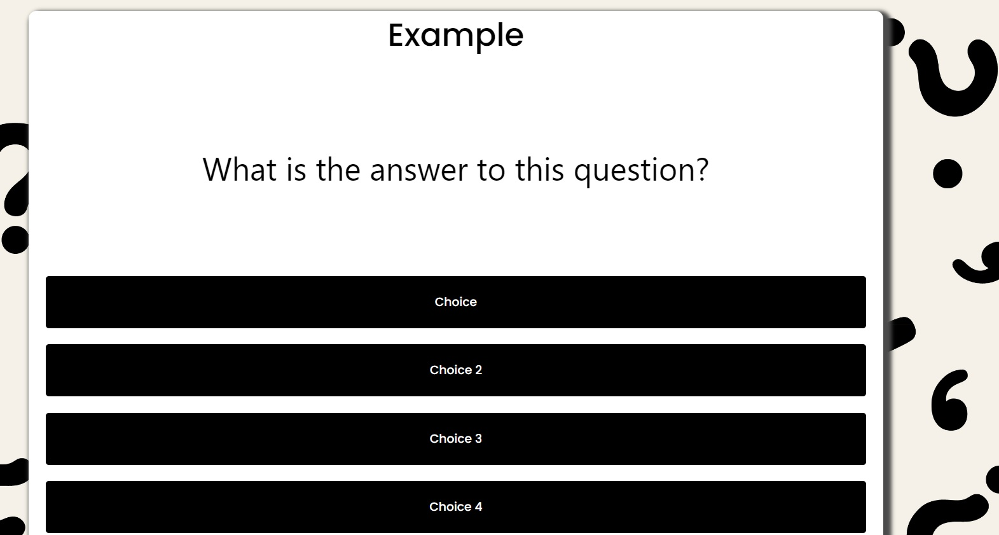
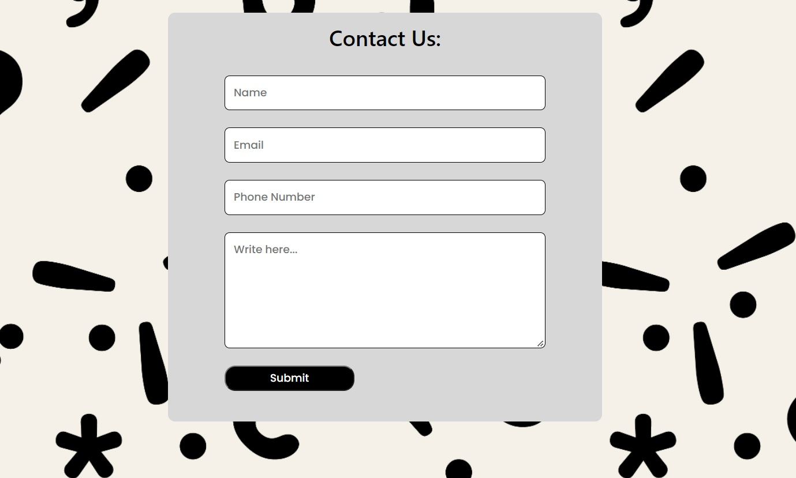
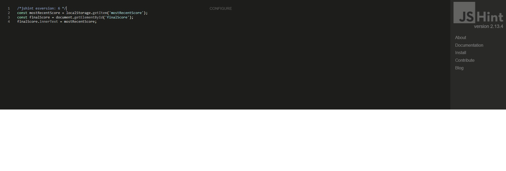
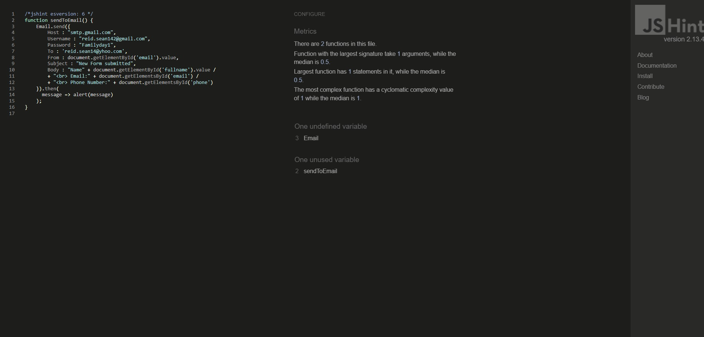
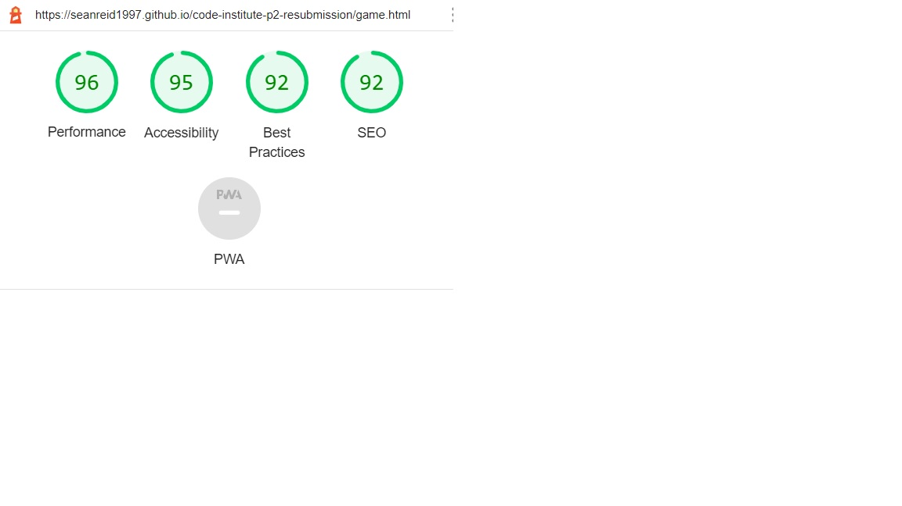
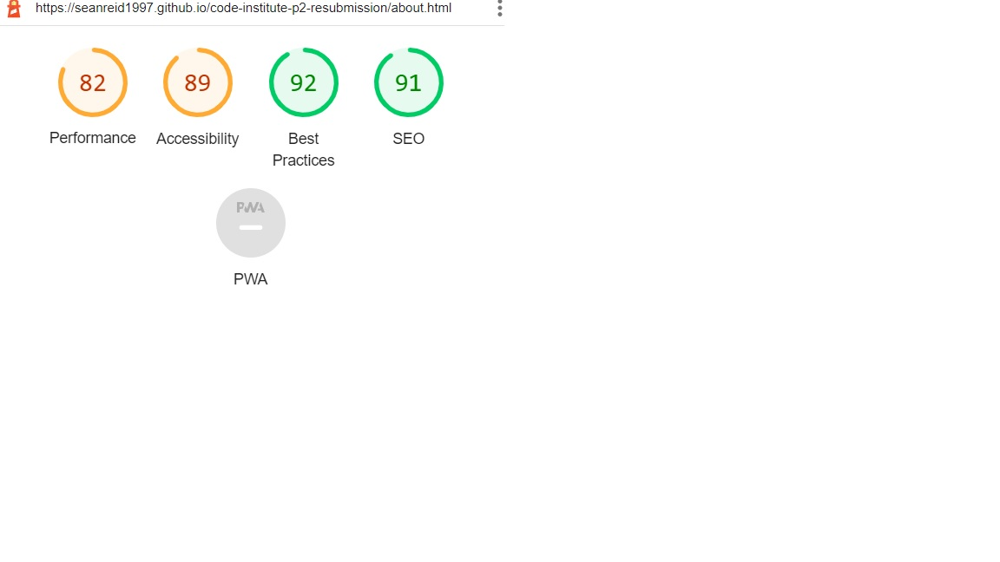
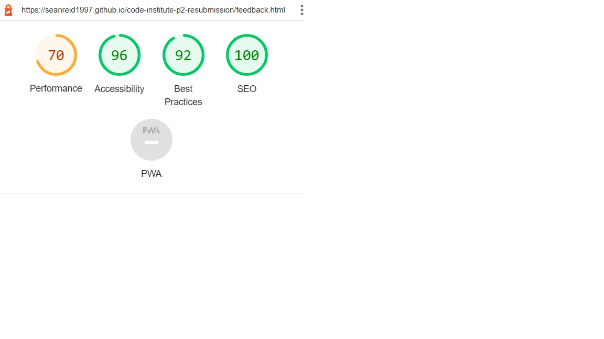
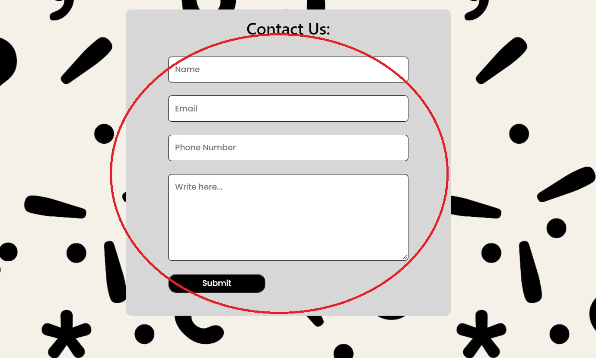
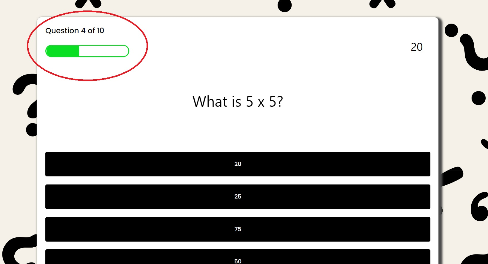

# Online Quiz
(Developer: Sean Reid)

<a href="https://seanreid1997.github.io/code-institute-p2-resubmission/" target="_blank">Live Website</a>

## Table of Contents

1. [Project Goals](#project-goals)
    1. [User Goals](#user-goals)
    2. [Site Owner Goals](#site-owner-goals)
2. [User Experience](#user-experience)
    1. [Targeted Audience](#targeted-audience)
    2. [User Requirements and Expectations](#user-requirements-and-expectations)
    3. [User Stories](#user-stories)
3. [Design](#design)
    1. [Design Choices](#design-choices)
    2. [Fonts](#fonts)
    3. [Structure](#structure)
    4. [Wireframes](#wireframes)
4. [Technologies Used](#technologies-used)
    1. [Languages](#languages)
    2. [Frameworks and Tools](#frameworks-and-tools)
5. [Features](#features)
6. [Testing](#validation)
7. [Bugs](#Bugs)
8. [Deployment](#deployment)
9. [Credits](#credits)
10. [Acknowledgements](#acknowledgements)

## Project Goals

### User Goals

<ul>
<li>Enjoy a quick simple game</li>
</ul>

### Site Owner Goals

<ul>
<li>For users to leave with a good experience.</li>
</ul>

## User Experience

### Targeted Audience

<ul>
<li>Anyone looking to play a quiz game.</li>
</ul>

### User Requirements and Expectations

<ul>
<li>User should be able to understand English</li>
<li>User should leave with a good impression</li>
</ul>

### User Stories

#### As A First Time User:

1. I want the site to be easily navigatable.
2. I want to be able view the website on various browsers.
3. I want to be able to view the website on different screen sizes.
4. I want to be able to leave feedback/contact.
5. I want to be able share the website via social media.
6. I want the website to be fully functional.

#### As A Site Owner:
7. I want the website to be browser compatible.
8. I want users to be able to track their progress.
9. I want users to be able to provide feedback on their experience.
10. I want the website to be responsive.
11. I want users to be able to return to home without using browser back button.

## Design

### Design Choices

### Fonts

The font style I used for this project was 'Poppins', which I accsessed via Google Fonts.

### Structure

### Wireframes

Home

Games

Main Game

Summary Page

About

Contact

## Technologies Used

### Languages

<ul>
<li>HTML</li>
<li>CSS</li>
<li>Javascript</li>
</ul>

### Frameworks and Tools

<ul>
<li>Balsamiq</li>
<li>FontAwesome</li>
<li>Git</li>
<li>Github</li>
<li>Gitpod</li>
<li>Google Fonts</li>
<li>Windows Paint App</li>
</ul>

## Features

### Home Page

<ul>
<li>The home page has a basic design.</li>
</ul>

Screenshots

### Games Selection Page

<ul>
<li>When you click on the 'games' page you will see a range of games to play.</li>
</ul>

Screenshots

### Game Page

<ul>
<li>On the game page you will be given a set questions and answers.</li>
<li>Theres also a progress bar and score tracker.</li>
</ul>

Screenshots

### Summary Page

<ul>
<li>After all questions have been answered you'll be redirected to the summary page.</li>
<li>Here you'll see your score and receive options on whether to play again or return home.</li>
</ul>

Screenshots

### About Us Page

<ul>
<li>The about us page gives a brief description of the website and it's goals.</li>
<li>Underneath the description is a map and address along with contact details.</li>
</ul>

Screenshots

### Contact Page

<ul>
<li>The contact page consists of a form which the user is required to fill out.</li>
<li>Here the user can leave feedback, suggestions or anything they'd like to discuss.</li>
</ul>

Screenshots

### Footer

<ul>
<li>Located at the bottom of every page is a footer</li>
<li>The footer consists of links to various social media websites</li>
<li>Also to the right-hand side of the footer is a link to our contact page.</li>
</ul>

Screenshots

### 404 Page

<ul>
<li>When the user enters the wrong url they'll be redirected to the 404 page.</li>
<li>The 404 page consists of a error message and a return home button.</li>
</ul>

Screenshots

## Testing

### Validation

### HTML

Home

Games

Game Page

Summary Page

About Us

Conatct

404 page

### CSS

Home

Games

Game Page

Summary Page

About Us

Conatct

404 page

### Javascript

Game Page

Summary Page

Conatct

### Accessablility

Home

Games

Game Page

Summary Page

About Us

Conatct

### Performance

Home

Games

Game Page

Summary Page

About Us

Conatct

404 page

### Device Testing

### Browser Compatibility

The website was tested on the browsers listed below:
<ul>
<li>Google Chrome</li>
<li>Microsoft Edge</li>
<li>Firefox</li>
</ul>

### Testing User Stories

1. I want the site to be easily navigatable.

| **Feature** | **Action** | **Expected Result** | **Actual Result** |
|-------------|------------|---------------------|-------------------|
| I want the site to be easily navigatable. | Browse through site | Site should be easy to navigate | Works as expected |

Screenshots

2. I want to be able view the website on various browsers.

| **Feature** | **Action** | **Expected Result** | **Actual Result** |
|-------------|------------|---------------------|-------------------|
| Browser compatibility | View site on different browsers | Site should be comaptible with other browsers | Works as expected|

Screenshots

3. I want to be able to view the website on different screen sizes.

| **Feature** | **Action** | **Expected Result** | **Actual Result** |
|-------------|------------|---------------------|-------------------|
| Responsive design | view device on different scren size | Site should adjust design based on screen size | Works as expected |

Screenshots

4. I want to be able to leave feedback/contact.

| **Feature** | **Action** | **Expected Result** | **Actual Result** |
|-------------|------------|---------------------|-------------------|
| Contact site owner/admin | User either fill is form or contact via email or call | User contacts admin successfully | Works as expected |

Screenshots

5. I want to be able share the website via social media.

| **Feature** | **Action** | **Expected Result** | **Actual Result** |
|-------------|------------|---------------------|-------------------|
| Social Media | User clicks on social media links | User is redirected to official site of social media | Works as expected |

Screenshots

6. I want the website to be fully functional.

| **Feature** | **Action** | **Expected Result** | **Actual Result** |
|-------------|------------|---------------------|-------------------|
| Functionality | Navigate site | No errors while navigating site | Works as expected |

Screenshots

7. I want the website to be browser compatible.

| **Feature** | **Action** | **Expected Result** | **Actual Result** |
|-------------|------------|---------------------|-------------------|
| Browser compatibility | View website on various browsers | Site should work properly | Works as expected |

Screenshots

8. I want users to be able to track their progress.

| **Feature** | **Action** | **Expected Result** | **Actual Result** |
|-------------|------------|---------------------|-------------------|
| Progress bar | Play game | User should be updated on how many questions left | Works as expected |

Screenshots

9. I want users to be able to provide feedback on their experience.

| **Feature** | **Action** | **Expected Result** | **Actual Result** |
|-------------|------------|---------------------|-------------------|
| Contact admin | User fills in form or contact via email/call | User should be able to contact site admin | Works as expected |

Screenshots

10. I want the website to be responsive.

| **Feature** | **Action** | **Expected Result** | **Actual Result** |
|-------------|------------|---------------------|-------------------|
| Responsivity | View site on different screen sizes | Site should alter display depending on screen size | Works as expected |

Screenshots

11. I want users to be able to return to home without using browser back button.

| **Feature** | **Action** | **Expected Result** | **Actual Result** |
|-------------|------------|---------------------|-------------------|
| Return home button on 404 page | User is redirected to 404 page | Selecting the return home button returns user to home page | Works as expected |

Screenshots

## Bugs

### Unfixed Bugs

<ul>
<li>Map logs an error to the console.</li>
<li>Summary page logs an error to the console but works as it should.</li>
</ul>

## Deployment

### Github Pages

The site was deployed to GitHub Pages via the following steps:
<ul>
<li>Within the GitHub repository, navigate to the Settings tab.</li>
<li>In the menu on the left select Pages.</li>
<li>From the Source Branch menu seclect Main and save.</li>
<li>Once complete the page will provide a link to deployed website.</li>
<li>After a few minutes, refrsh the page and the site will be ready.</li>

</ul>

## Credits

### Code Institute

<ul>
<li>The template used for this website was the CI template from Code Institute.</li>
<li>The main structure of the javascript was from a youtube tutorial made on the Brian Design channel. <a href="https://www.youtube.com/watch?v=f4fB9Xg2JEY">Brian Design.</a></li>
</ul>

### Content

<ul>
<li>Code for project was based on my previous project <a href="https://github.com/seanreid1997/code-institute-p2">Project 2</a></li>
</ul>

 ### Media 
 
 <ul>
 <li>Background image for this project was taken from <a href="https://www.freepik.com/vectors/question-pattern">
 Question pattern vector created by vilmosvarga - www.freepik.com</a></li>
 <li>Favicon used was from <a href="https://favicon.io/">favicon.io/</a></li>
 <li>Embedded map was taken from <a href="https://www.embedgooglemap.net/">https://www.embedgooglemap.net/</a></li>
 </ul>

 ## Acknowledgements

 <ul>
 <li>I would like to thank my mentor Mo Shami for his continued guidance and support, especially with my busy lifestyle.</li>
 <li>I would also like to extend my gratitude to the Code institute family for their support and understanding.</li>
 </ul>
 
 [Return To Top](#Online-Quiz)